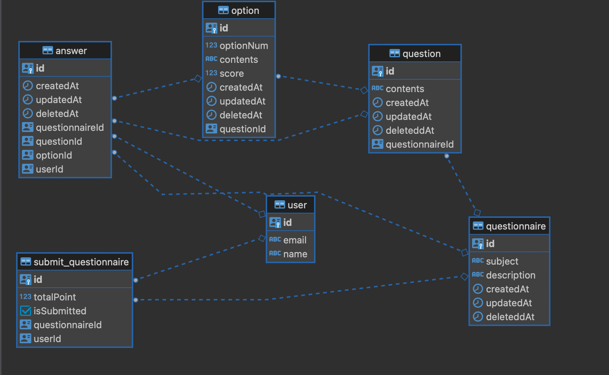

## 정보

### 사용스택

- TypeScript
- NestJS
- GraphQL
- TypeORM
- PostgreSQL
- Docker

### 해당 애플리케이션 설명

- 중복 선택이 불가능한 설문지
- 문항 개수에는 제한이 없지만 선택지는 최소 1개 ~ 10개로 제한
- 선택지의 점수는 수동 설정 가능하며, 수동 설정을 안할 시 선택지의 번호가 점수로 설정됨

## DB

### ERD



## API 목록

### User

- fetchAllUser : 모든 유저 조회
- fetchOneUser : 유저 한명 조회
- createUser : 유저 생성
- updateUser : 유저 수정
- softDeleteUser : 유저 삭제

### SubmitQuestionnaire

- fetchAllSubmitQuestionnaire : 모든 완료된 설문지 조회
- fetchOneSubmitQuestionnaire : 완료된 설문지 한개 조회
- fetchUserSubmitQuestionnaire : 해당 유저의 완료한 설문지 조회
- softDeleteSubmitQuestionnaire : 완료된 설문지 삭제

### Questionnaire

- fetchAllQuestionnaire : 모든 설문지 조회
- fetchAllQuestionnaire : 설문지 한개 조회
- createQuestionnaire : 설문지 생성
- updateQuestionnaire : 설문지 수정
- softDeleteQuestionnaire : 설문지 삭제

### Question

- fetchAllQuestion : 모든 문항 조회
- fetchOneQuestion : 문한 한개 조회
- createQuestion : 문항 생성
- updateQuestion : 문항 수정
- softDeleteQuestion : 문항 삭제

### Option

- fetchAllOption : 모든 선택지 조회
- fetchOneOption : 선택지 한개 조회
- createOption : 선택지 생성
- updateOption : 선택지 수정
- softDeleteOption : 선택지 삭제

### Answer

- fetchAllAnswer : 모든 답변 조회
- fetchOneAnswer : 답변 한개 조회
- submitQuestionnaire : 답변 제출(설문지 제출)
- createAnswer : 답변 생성
- updateAnswer : 답변 수정
- softDeleteAnswer : 답변 삭제

## 실행방법

### yarn 설치

```bash
$ npm install -g yarn
```

### Docker 설치

```bash
Docker설치 가이드 : https://docs.docker.com/get-docker/
```

### .env.docker 파일 생성 및 아래 내용을 넣는다.

```bash
SERVER_PORT=4000

PG_HOST=maum-db
PG_PORT=5432
PG_USERNAME=postgres
PG_PASSWORD=postgres
PG_DATABASE=postgres
```

## 실행

```bash
$ docker-compose up --build
```
